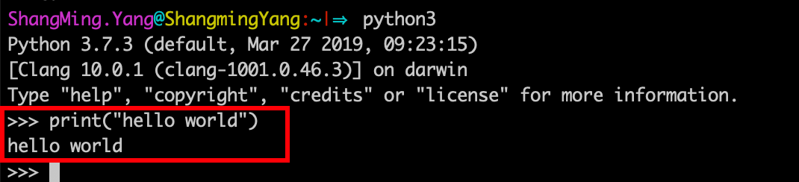
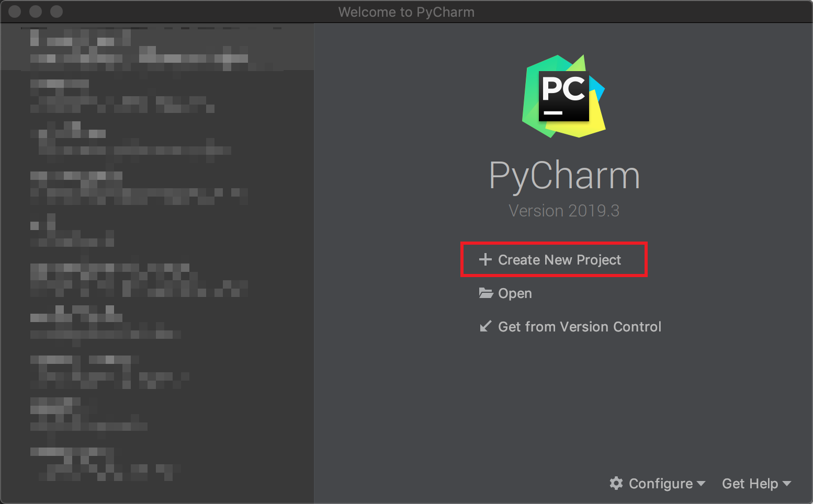
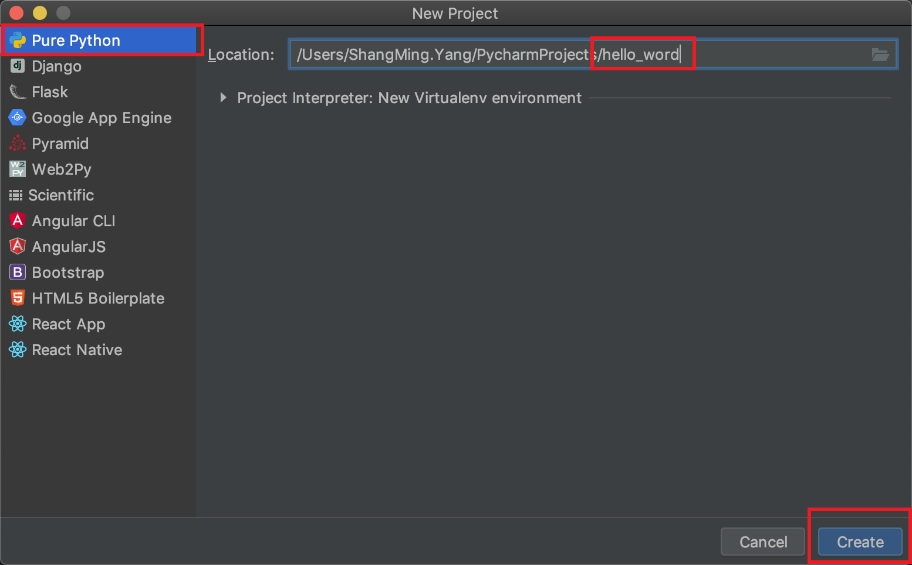
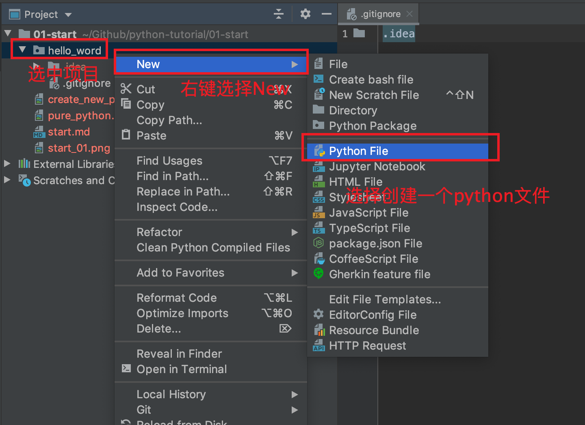
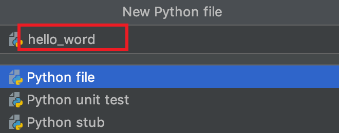
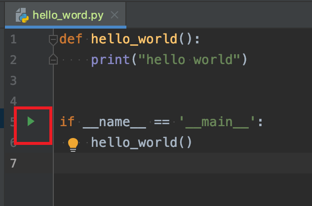
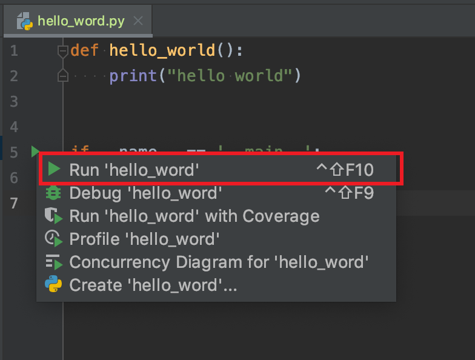
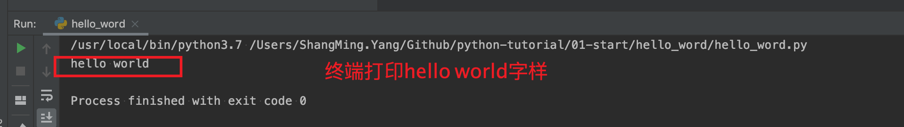

## python简介
- python是一门解释性语言，诞生于上世纪90年代。当前主要存在的版本为python2 和python3，两者为不兼容的版本。推荐使用python3，python2将于2020年停止更新。


## 如何使用
打开终端，输入`python3`
> print("hello world")

可以看到终端返回`hello world`字样


## 什么叫IDE？
- ***IDE***: *Integrated Development Environment*，集成开发环境，用来提供代码编写，代码调试，代码编译等功能，一般是具有图形界面的软件。

- ***Pycharm***: *Jetrains*公司出品的一款用来开发*Python*的IDE软件，分为社区版和商业版，下载地址：[download](https://www.jetbrains.com/pycharm/)

### 使用Pycharm运行hello world
1. 打开pycharm程序
2. 创建一个新的project
3. 
4. 
5. 
6. 
7. hello world代码如下：

```python
def hello_world():
    print("hello world")

if __name__ == '__main__':
    hello_world()

```
8. 运行程序


